Awesome LaTeX drawing
============

<h6 align="center">Made by Xinyu Chen • :globe_with_meridians: <a href="https://xinychen.github.io">https://xinychen.github.io</a></h6>

**awesome-latex-drawing** is a collection of **30+** academic drawing examples for using LaTeX, including Bayesian networks, function plotting, graphical models, tensor structure, and technical frameworks.

 

## Description

LaTeX is a high-quality typesetting system available as free software, widely used in recent years for creating academic graphics. Its popularity stems from its ability to handle complex illustrations with special symbols and mathematical equations, making it ideal for drawing detailed graphics in research.

This project introduces several graphics created using LaTeX, with examples that are easy to follow on Overleaf, a popular online LaTeX platform. If you're interested, feel free to explore and reproduce our examples on Overleaf at [overleaf.com](https://www.overleaf.com/).

 

## Contents

### Table of Examples

- **Bayesian networks**
  - [x] [Bayesian network of Bayesian CP factorization (BCPF)](https://github.com/xinychen/awesome-latex-drawing#example-1)
  - [x] [Bayesian network of Bayesian Gaussian CP (BGCP) factorization](https://github.com/xinychen/awesome-latex-drawing#example-2)
  - [x] [Bayesian network of Bayesian augmented tensor factorization (BATF)](https://github.com/xinychen/awesome-latex-drawing#example-3)
  - [x] [Bayesian network of Bayesian temporal matrix factorization (BTMF)](https://github.com/xinychen/awesome-latex-drawing#example-4)
   
- **Graphical models**
  - [x] [Partially observed time series matrix and tensor](https://github.com/xinychen/awesome-latex-drawing#example-5)
  - [x] [Matrix and tensor time series prediction in the presence of missing values](https://github.com/xinychen/awesome-latex-drawing#example-6)
  - [x] [Undirected and circulant graphs on the relational data samples with certain degrees](https://github.com/xinychen/awesome-latex-drawing#example-7)
  - [x] [Laplacian convolutional time series modeling](https://github.com/xinychen/awesome-latex-drawing#example-8)
   
- **`pgfplots` function plotting**
  - [x] [PDF and CDF functions of Erlang distribution](https://github.com/xinychen/awesome-latex-drawing#example-9)
  - [x] [PDF of normal distribution with different means and variances](https://github.com/xinychen/awesome-latex-drawing#example-10)
  - [x] [(Joint) PDF functions of Lognormal distributions](https://github.com/xinychen/awesome-latex-drawing#example-11)
  - [x] [Iterative process of conjugate gradient for solving a system of linear equations](https://github.com/xinychen/awesome-latex-drawing#example-12)
  - [x] [Random and non-random missing patterns](https://github.com/xinychen/awesome-latex-drawing#example-13)
  - [x] [Sine and Cosine functions](https://github.com/xinychen/awesome-latex-drawing#example-14)
  - [x] [Mechanism of time series forecasting](https://github.com/xinychen/awesome-latex-drawing#example-15)
   
- **`tikz` for matrix structure**
  - [x] [Graphical illustration of the multivariate time series forecasting problem](https://github.com/xinychen/awesome-latex-drawing#example-16)
  - [x] [Graphical illustration of the temporal matrix factorization](https://github.com/xinychen/awesome-latex-drawing#example-17)
  - [x] [Graphical illustration of the rolling time series forecasting with temporal matrix factorization](https://github.com/xinychen/awesome-latex-drawing#example-18)
   
- **`tikz-3dplot` for tensor structure**
  - [x] [Graphical illustration for the (origin, destination, time slot) tensor](https://github.com/xinychen/awesome-latex-drawing#example-19)
  - [x] [Graphical illustration of the classical CP tensor factorization on a third-order tensor](https://github.com/xinychen/awesome-latex-drawing#example-20)
  - [x] [Graphical illustration of augmented tensor factorization (AuTF) model](https://github.com/xinychen/awesome-latex-drawing#example-21)
  - [x] [Graphical illustration of tensor completion task and its framework](https://github.com/xinychen/awesome-latex-drawing#example-22)
  - [x] [Graphical illustration of low-rank autoregressive tensor completion model](https://github.com/xinychen/awesome-latex-drawing#example-23)
  - [x] [Graphical illustration of singular value thresholding process of the tensor data with unitary transform](https://github.com/xinychen/awesome-latex-drawing#example-24)
  - [x] [Graphical illustration of low-rank tensor completion model](https://github.com/xinychen/awesome-latex-drawing#example-25)
  - [x] [Graphical illustration of low-rank tensor regression model](https://github.com/xinychen/awesome-latex-drawing#example-26)

 

## Gallery

Looking for some good LaTeX drawing examples? Here are 30+ graphics for showing how to draw in LaTaX.

### Bayesian Networks

LaTeX provides some powerful domain-specific packages and tools like `tikz` to enable flexible graphical models. Bayesian networks represent a family of graphical models consisting of variables (usually denoted by nodes) and dependency relationships (usually denoted by arrows). Fortunately, `tikz` has a specific library for drawing Bayesian networks and directed factor graphs.

> Another toolbox in Python: [https://docs.daft-pgm.org/en/latest/](https://docs.daft-pgm.org/en/latest/)

#### Bayesian Tensor Factorization

##### [Example 1]

This example is from the following paper:

> - Qibin Zhao, Liqing Zhang, Andrzej Cichocki (2015). [Bayesian CP factorization of incomplete tensors with automatic rank determination](https://doi.org/10.1109/TPAMI.2015.2392756). IEEE Transactions on Pattern Analysis and Machine Intelligence, 37(9): 1751-1763.

<a href="https://github.com/xinychen/awesome-latex-drawing/blob/master/BayesNet/BCPF.tex">
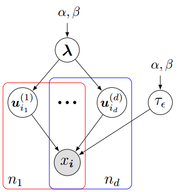
</a>
which shows the Bayesian network of Bayesian CP factorization (BCPF) model. To draw this Bayesian network example, there are some preliminaries to follow:

 

- **`preamble` codes**:
  1. define the `documentclass` as `standalone`, e.g., `\documentclass[border = 0.1cm]{standalone}` with 0.1cm border,
  2. use the package `tikz`, i.e., `\usepackage{tikz}`, and use `tikz` library like `\usetikzlibrary{bayesnet}` which is an important tool for drawing Bayesian networks and directed factor graphs,
  3. set the `tikz` style by using the `\tikzstyle{}` command,
  4. use math equation environments including `\usepackage{amsfonts, amsmath, amssymb}`.
- **`body` codes**:
  1. use `\begin{tikzpicture} \end{tikzpicture}` to start drawing,
  2. use `\node` to define nodes and text boxes in the Bayesian network,
  3. use `\path` to define arrows in the Bayesian network,
  4. use `\plate` to define plates in the Bayesian network.

> Please click on the image and check out the source code.

 

- Open [BGCP.tex](https://github.com/xinychen/awesome-latex-drawing/blob/master/BayesNet/BGCP.tex) in your overleaf project, then you will see the following pictures about BGCP (Bayesian Gaussian CP decomposition) model as a Bayesian network and a directed factor graph:

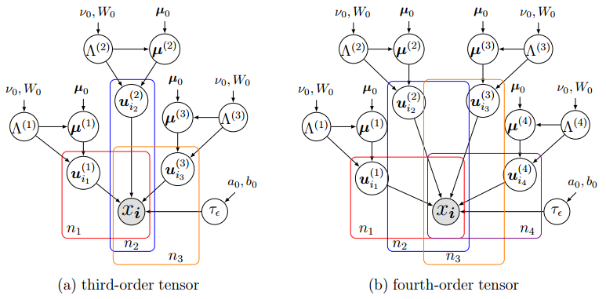

 

##### [Example 2] 

This example is from the following paper:

> Xinyu Chen, Zhaocheng He, Lijun Sun (2019). [A Bayesian tensor decomposition approach for spatiotemporal traffic data imputation](https://doi.org/10.1016/j.trc.2018.11.003). Transportation Research Part C: Emerging Technologies, 98: 73-84.

<a href="https://github.com/xinychen/awesome-latex-drawing/blob/master/BayesNet/BGCP-1.tex">
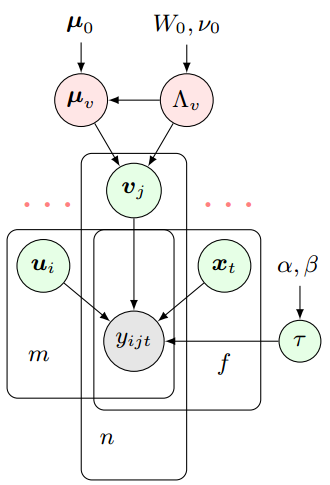
</a>
which shows the Bayesian network of Bayesian Gaussian CP factorization (BGCP) model. To draw this Bayesian network example, there are some preliminaries to follow:

- **`preamble` codes**:
  1. define the `documentclass` as `standalone`, e.g., `\documentclass[border = 0.1cm]{standalone}` with 0.1cm border,
  2. use the package `tikz`, i.e., `\usepackage{tikz}`, and use `tikz` library like `\usetikzlibrary{bayesnet}` which is an important tool for drawing Bayesian networks and directed factor graph,
  3. set the `tikz` style by using the `\tikzstyle{}` command,
  4. use math equation environments including `\usepackage{amsmath, amsfonts, amssymb}`.
- **`body` codes**:
  1. use `\begin{tikzpicture} \end{tikzpicture}` to start drawing,
  2. use `\node` to define nodes and text boxes in the Bayesian network,
  3. use `\path` to define arrows in the Bayesian network,
  4. use `\plate` to define plates in the Bayesian network.

> Please click on the image and check out the source code. If you are interested in the original [Bayesian network of BGCP](BayesNet/BGCP.png) in the paper, please check out [BGCP.tex](https://github.com/xinychen/awesome-latex-drawing/blob/master/BayesNet/BGCP.tex).

 

##### [Example 3]

This example is from the following paper:

> Xinyu Chen, Zhaocheng He, Yixian Chen, Yuhuan Lu, Jiawei Wang (2019). [Missing traffic data imputation and pattern discovery with a Bayesian augmented tensor factorization model](https://doi.org/10.1016/j.trc.2019.03.003). Transportation Research Part C: Emerging Technologies, 104: 66-77.

<a href="https://github.com/xinychen/awesome-latex-drawing/blob/master/BayesNet/BATF.tex">
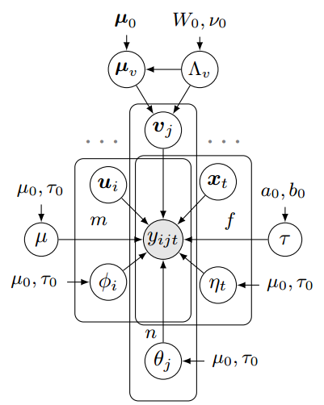
</a>
which shows the Bayesian network of Bayesian augmented tensor factorization (BATF) model. To draw this Bayesian network example, there are some preliminaries to follow:

- **`preamble` codes**:
  1. define the `documentclass` as `standalone`, e.g., `\documentclass[border = 0.1cm]{standalone}` with 0.1cm border,
  2. use the package `tikz`, i.e., `\usepackage{tikz}`, and use `tikz` library like `\usetikzlibrary{bayesnet}` which is an important tool for drawing Bayesian networks and directed factor graph,
  3. set the `tikz` style by using the `\tikzstyle{}` command,
  4. use math equation environments including `\usepackage{amsmath, amsfonts, amssymb}`.
- **`body` codes**:
  1. use `\begin{tikzpicture} \end{tikzpicture}` to start drawing,
  2. use `\node` to define nodes and text boxes in the Bayesian network,
  3. use `\path` to define arrows in the Bayesian network,
  4. use `\plate` to define plates in the Bayesian network.

> Please click on the image and check out the source code.

 

##### [Example 4]

<!-- > - Open [btmf.tex](https://github.com/xinychen/awesome-latex-drawing/blob/master/BayesNet/btmf_net.tex) in your overleaf project, then you will see the following picture:
  >
  > 

  > 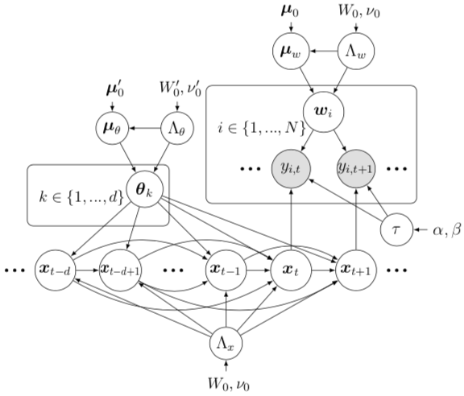
  > 

  >
  > 

  > <b>Figure 5</b>: BTMF (Bayesian temporal matrix factorization) model as a Bayesian network and a directed factor graph.
  > 
 -->

This example is from the following paper:

> Xinyu Chen, Lijun Sun (2021). [Bayesian temporal factorization for multidimensional time series prediction](https://doi.org/10.1109/TPAMI.2021.3066551). IEEE Transactions on Pattern Analysis and Machine Intelligence, 44 (9): 4659-4673.

<a href="https://github.com/xinychen/awesome-latex-drawing/blob/master/BayesNet/BTMF.tex">
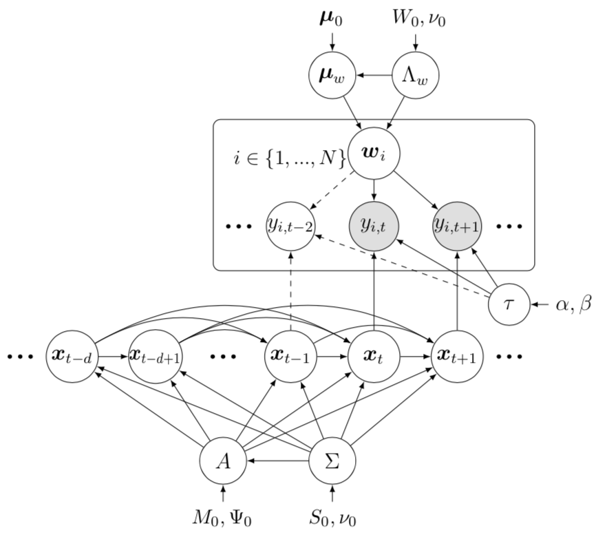
</a>
which shows the Bayesian network of Bayesian temporal matrix factorization (BTMF) model. To draw this Bayesian network example, there are some preliminaries to follow:

- **`preamble` codes**:
  1. define the `documentclass` as `standalone`, e.g., `\documentclass[border = 0.1cm]{standalone}` with 0.1cm border,
  2. use the package `tikz`, i.e., `\usepackage{tikz}`, and use `tikz` library like `\usetikzlibrary{bayesnet}` which is an important tool for drawing Bayesian networks and directed factor graph,
  3. set the `tikz` style by using the `\tikzstyle{}` command,
  4. use math equation environments including `\usepackage{amsmath, amsfonts, amssymb}`.
- **`body` codes**:
  1. use `\begin{tikzpicture} \end{tikzpicture}` to start drawing,
  2. use `\node` to define nodes and text boxes in the Bayesian network,
  3. use `\path` to define arrows in the Bayesian network,
  4. use `\plate` to define plates in the Bayesian network.

> Please click on the image and check out the source code. Instead of multivariate vector autoregressive process on temporal factors, we can also use univariate autoregressive process to rebuild BTMF. The Beyasian network is available at [btmf_net.png](BayesNet/btmf_net.png), you can also check out the source code [btmf_net.tex](https://github.com/xinychen/awesome-latex-drawing/blob/master/BayesNet/btmf_net.tex).

 

### Graphical Models

##### [Example 5]

 

These two examples show the partially observed time series matrix and tensor, respectively. To draw both two examples, we can follow these steps:

- **`preamble` codes**:
  1. define the `documentclass` as `standalone`,
  2. use the package `tikz`.

- **`body` codes**:
  1. use `\begin{tikzpicture} \end{tikzpicture}` to start drawing,
  2. use `\node` to define nodes and text boxes in the graphical model,
  3. use `\path` to define arrows in the graphical model.

 

##### [Example 6]

 

These two examples show the time series prediction in the presence of missing values. To draw both two examples, we can follow these steps:

- **`preamble` codes**:
  1. define the `documentclass` as `standalone`,
  2. use the package `tikz`.

- **`body` codes**:
  1. use `\begin{tikzpicture} \end{tikzpicture}` to start drawing,
  2. use `\node` to define nodes and text boxes in the graphical model,
  3. use `\path` to define arrows in the graphical model.

 

##### [Example 7]

These two examples show the undirected and circulant graphs on the relational data samples with certain degrees. To draw both two examples, we can follow these steps:

- **`preamble` codes**:
  1. define the `documentclass` as `standalone`,
  2. use the package `tikz`.

- **`body` codes**:
  1. use `\begin{tikzpicture} \end{tikzpicture}` to start drawing,
  2. use `\node` to define nodes,
  3. use `\path` to define arrows.

 

##### [Example 8]

<a href="https://github.com/xinychen/awesome-latex-drawing/blob/master/Framework/Laplacian_convolutional_time_series.tex">
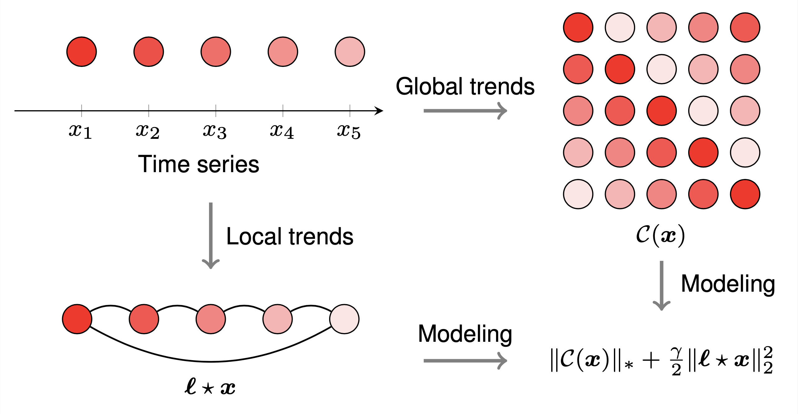
</a>

This example is from the following paper:

> Xinyu Chen, Zhanhong Cheng, HanQin Cai, Nicolas Saunier, Lijun Sun (2024). [Laplacian convolutional representation for traffic time series imputation](https://doi.org/10.1109/TKDE.2024.3419698). IEEE Transactions on Knowledge and Data Engineering. 36 (11): 6490-6502.

which gives a graphical illustration of the Laplacian convolutional model for time series imputation. To draw the example, we can follow these steps:

- **`preamble` codes**:
  1. define the `documentclass` as `standalone`,
  2. use the package `tikz`.
- **`body` codes**:
  1. use `\begin{tikzpicture} \end{tikzpicture}` to start drawing,
  2. use `\begin{axis} \end{axis}` and `\addplot` to draw coordinates,
  3. use `\node` and `\path` to draw nodes and arrows.

 

### `pgfplots` Function Plotting

##### [Example 9]

<a href="https://github.com/xinychen/awesome-latex-drawing/blob/master/pgfplots-function/erlang_cdf.tex">
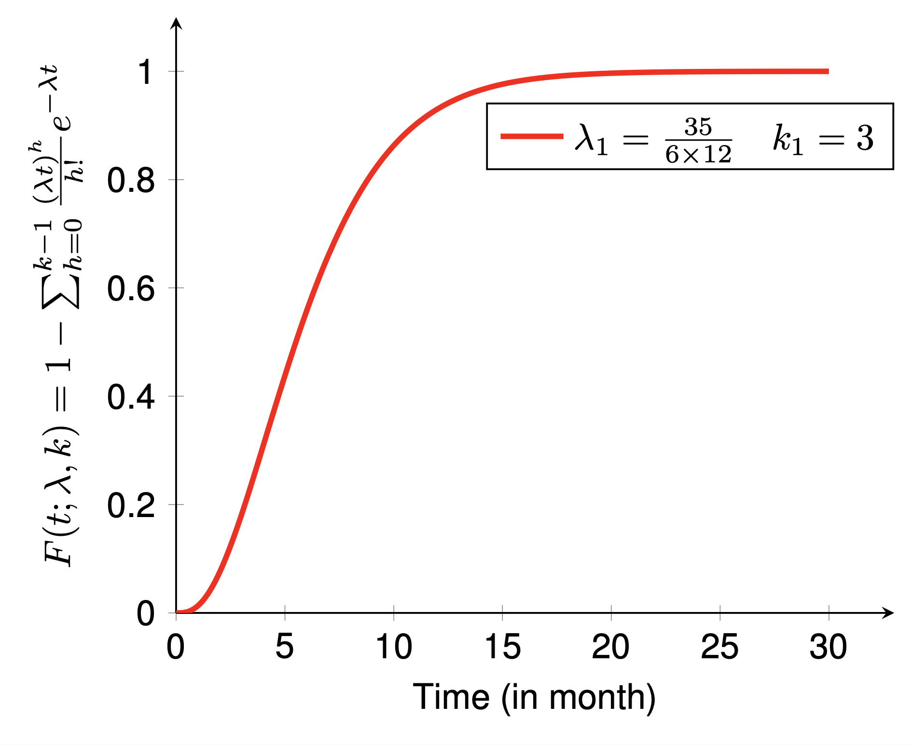
</a>

These two examples show the probability density function (PDF) and cumulative density function (CDF) of Erlang distribution, respectively. To draw the example, there are few steps to follow:

- **`preamble` codes**:
  1. define the `documentclass` as `standalone`,
  2. use the package `pgfplots`,
  3. set font style and adjust `\pgfplotsset{}` as you prefer.
- **`body` codes**:
  1. use `\begin{tikzpicture} \end{tikzpicture}` to start drawing,
  2. use `\begin{axis} \end{axis}` to draw the function,
  3. use `\addplot` to define the function for drawing.

 

##### [Example 10]

<a href="https://github.com/xinychen/awesome-latex-drawing/blob/master/pgfplots-function/normal_pdf.tex">
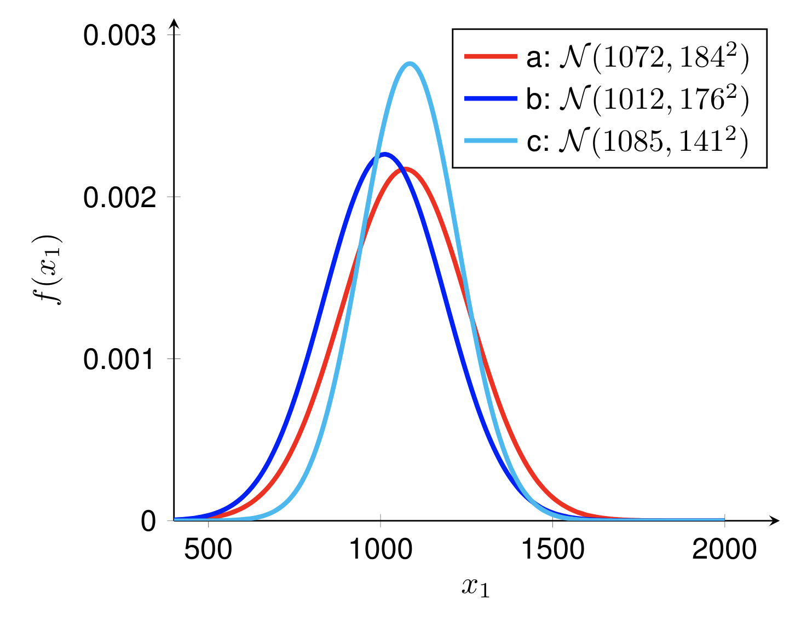
</a>

This example shows the PDF of normal distribution with different means and variances. To draw this example, there are few step to follow:

- **`preamble` codes**:
  1. define the `documentclass` as `standalone`,
  2. use the package `pgfplots`,
  3. set font style and adjust `\pgfplotsset{}` as you prefer.
- **`body` codes**:
  1. use `\pgfmathdeclarefunction` to define the PDF function of normal (Gaussian) distribution,
  2. use `\begin{tikzpicture} \end{tikzpicture}` to start drawing,
  3. use `\begin{axis} \end{axis}` to draw the function,
  4. use `\addplot` to define the function for drawing.
- **More posts**:
  1. [Plotting Normal distribution in pgfplots](https://tex.stackexchange.com/questions/100022)
  2. [number format in pgfplots axis](https://tex.stackexchange.com/questions/31276)
  3. [Remove the scientific notation which is unreasonable](https://tex.stackexchange.com/questions/119887)

 

##### [Example 11]

<a href="https://github.com/xinychen/awesome-latex-drawing/blob/master/pgfplots-function/lognormal_pdf.tex">
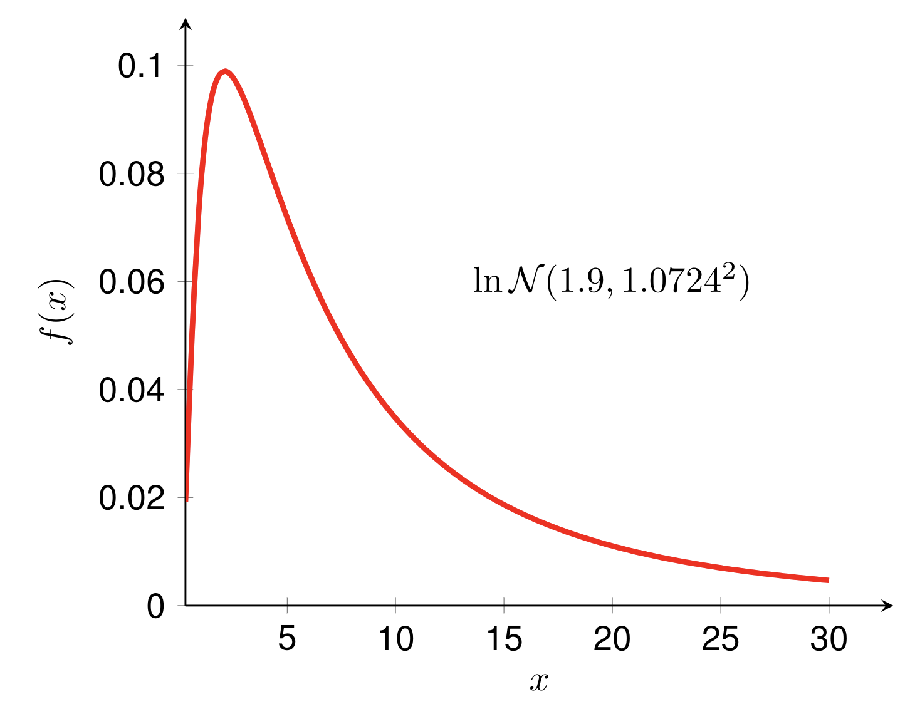
</a>
<a href="https://github.com/xinychen/awesome-latex-drawing/blob/master/pgfplots-function/bilognormal_pdf.tex">
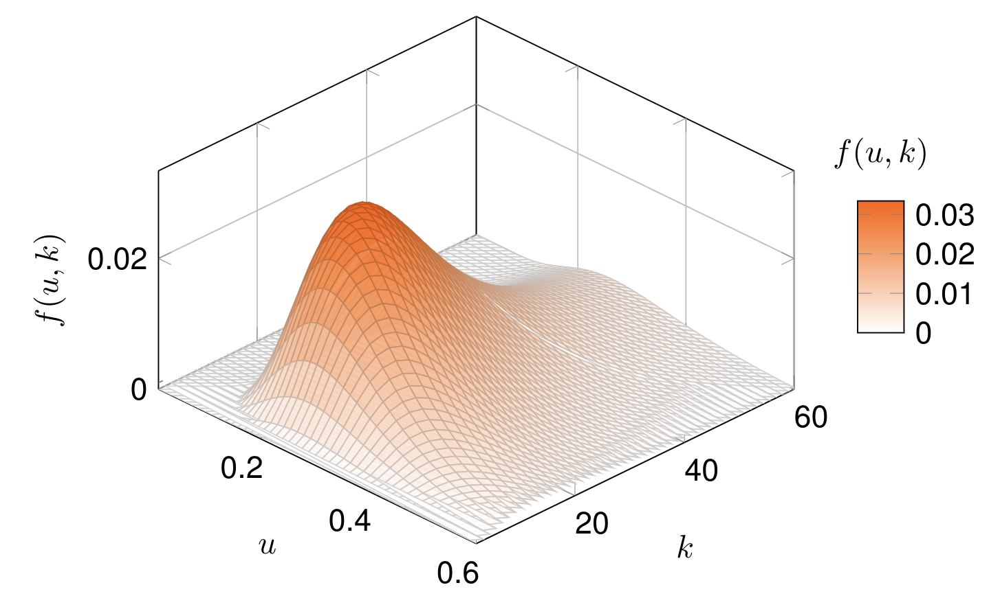
</a>

These two examples show the PDF and joint PDF of Lognormal distributions, respectively. There are some recommended material to follow the examples:

- **More posts**:
  1. [Draw a bivariate normal distribution in TikZ](https://tex.stackexchange.com/questions/31708)
  2. [How can two bivariate normal distributions be plotted in one plot?](https://tex.stackexchange.com/questions/198741)
  3. [Plotting a Bivariate Normal Distribution in Tikz](https://tex.stackexchange.com/questions/236721)
  4. [Split curve with addplot3](https://tex.stackexchange.com/questions/629567)

 

##### [Example 12]

These two examples show the iterative process of conjugate gradient for solving a system of linear equations.

 

##### [Example 13]

These two examples show the random and non-random missing patterns. To draw both two examples, we can follow these steps:

- **`preamble` codes**:
  1. define the `documentclass` as `standalone`,
  2. use both `tikz` and `pgfplots` packages,
  3. use `\begin{filecontents} \end{filecontents}` to contain the data.
- **`body` codes**:
  1. use `\begin{tikzpicture} \end{tikzpicture}` to start drawing,
  2. use `\begin{axis} \end{axis}` to draw the function,
  3. use `\addplot` to draw the data.

 

##### [Example 14]

<a href="https://github.com/xinychen/awesome-latex-drawing/blob/master/pgfplots-function/sin_cos_functions.tex">
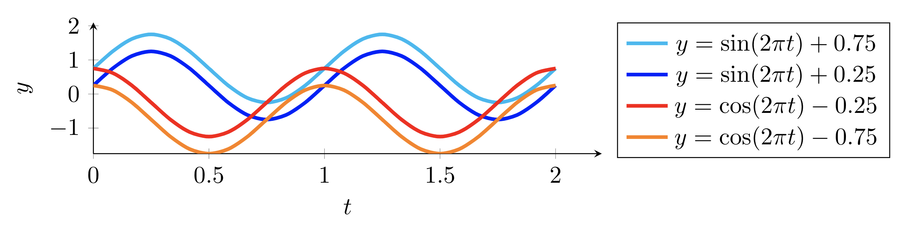
</a>

This example shows four sequences consisting of Sine and Cosine functions. When regarding these sequences as time series, then we can see two kinds of temporal dynamics, that is, one is from Sine function, while another is from Cosine function. To draw this example, we can follow these steps:

- **`preamble` codes**:
  1. define the `documentclass` as `standalone`,
  2. use the package `pgfplots`,
  3. set font style and adjust `\pgfplotsset{}` as you prefer.
- **`body` codes**:
  1. use `\pgfmathdeclarefunction` to define the PDF function of normal (Gaussian) distribution,
  2. use `\begin{tikzpicture} \end{tikzpicture}` to start drawing,
  3. use `\begin{axis} \end{axis}` to draw the function,
  4. use `\addplot` to define the function for drawing.

 

##### [Example 15]

This example illustrates the mechanism of time series forecasting on streaming data in our [tracebase](https://github.com/xinychen/tracebase) project. To draw this example, we can follow these steps:

<a href="https://github.com/xinychen/awesome-latex-drawing/blob/master/pgfplots-function/forecasting.tex">
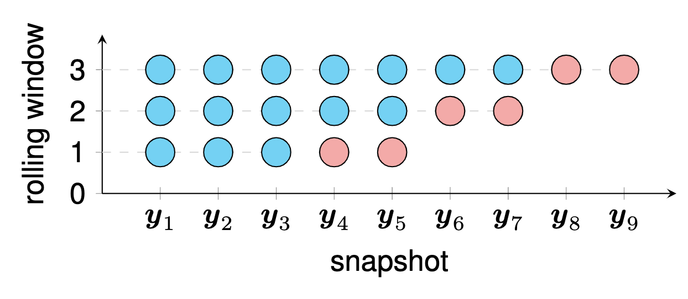
</a>

- **`preamble` codes**:
  1. define the `documentclass` as `standalone`,
  2. use both `tikz` and `pgfplots` packages,
  3. set font style and adjust `\pgfplotsset{}` as you prefer.
- **`body` codes**:
  1. use `\begin{tikzpicture} \end{tikzpicture}` to start drawing,
  2. use `\begin{axis} \end{axis}` to define the graphic,
  3. use `addplot` to define the marks at some coordinates and specify the color of these marks.

 

### `tikz` for Matrix Structure

##### [Example 16]

This example gives a graphical illustration of the multivariate time series forecasting problem with missing values. To draw this example, we can follow these steps:

- **`preamble` codes**:
  1. define the `documentclass` as `standalone`,
  2. use the package `tikz`.
- **`body` codes**:
  1. set `\Depth`, `\Width`, and `\Height` parameters by using `\newcommand`,
  2. use `\begin{tikzpicture} \end{tikzpicture}` to start drawing,
  3. use `\draw`, `\filldraw`, and `\node` commands to define rectangles and nodes.

 

##### [Example 17]

This example gives a graphical illustration of the temporal matrix factorization. To draw this example, we can follow these steps:

- **`preamble` codes**:
  1. define the `documentclass` as `standalone`,
  2. use the package `tikz`.
- **`body` codes**:
  1. use `\begin{tikzpicture} \end{tikzpicture}` to start drawing,
  2. use `\draw` and `\filldraw` to set nodes and rectangles.

 

##### [Example 18]

This example gives a graphical illustration of the rolling time series forecasting with temporal matrix factorization. To draw this example, we can follow these steps:

- **`preamble` codes**:
  1. define the `documentclass` as `standalone`,
  2. use the package `tikz`.
- **`body` codes**:
  1. use `\begin{tikzpicture} \end{tikzpicture}` to start drawing,
  2. use `\draw` and `\filldraw` to set nodes and rectangles.

 

### `tikz-3dplot` for Tensor Structure

##### [Example 19]

This example gives a graphical illustration of a third-order tensor. To draw this example, we can follow these steps:

<a href="https://github.com/xinychen/awesome-latex-drawing/blob/master/TensorFactorization/tensor.tex">
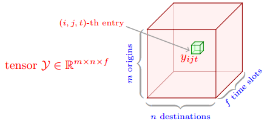
</a>

- **`preamble` codes**:
  1. define the `documentclass` as `standalone`,
  2. use both `tikz` and `tikz-3dplot` packages.
- **`body` codes**:
  1. set `\Depth`, `\Width`, and `\Height` parameters by using `\newcommand`,
  2. use `\begin{tikzpicture} \end{tikzpicture}` to start drawing,
  3. define the coordinates of the tensor edges,
  4. use `\draw` command to define nodes.

 

##### [Example 20]

This example gives a graphical illustration of classical CP tensor factorization on a third-order tensor. To draw this example, we can follow these steps:

<a href="https://github.com/xinychen/awesome-latex-drawing/blob/master/TensorFactorization/CP_factorization.tex">
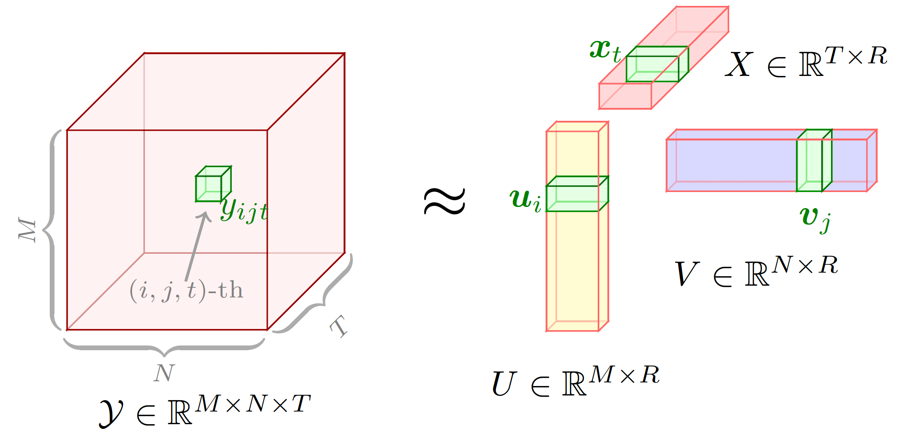
</a>

- **`preamble` codes**:
  1. define the `documentclass` as `standalone`,
  2. use both `tikz` and `tikz-3dplot` packages.
- **`body` codes**:
  1. set `\Depth`, `\Width`, and `\Height` parameters by using `\newcommand`,
  2. use `\begin{tikzpicture} \end{tikzpicture}` to start drawing,
  3. define the coordinates of the tensor edges,
  4. use `\draw` command to define nodes.

 

##### [Example 21]

<a href="https://github.com/xinychen/awesome-latex-drawing/blob/master/TensorFactorization/AuTF.tex">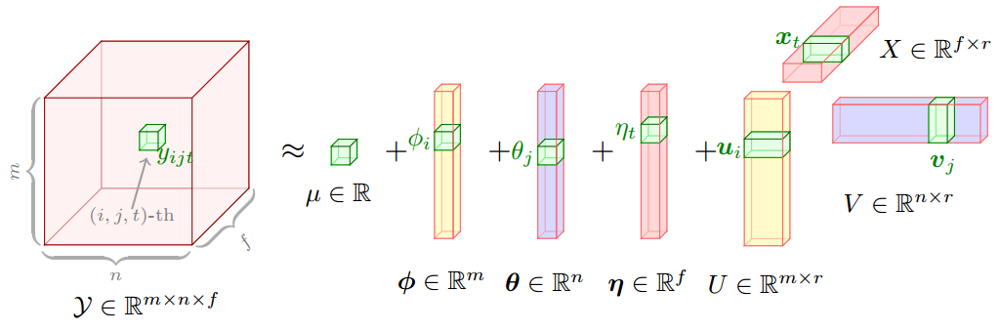
</a>

This example gives a graphical illustration of augmented tensor factorization model. To draw this example, we can follow these steps:

- **`preamble` codes**:
  1. define the `documentclass` as `standalone`,
  2. use both `tikz` and `tikz-3dplot` packages.
- **`body` codes**:
  1. set `\Depth`, `\Width`, and `\Height` parameters by using `\newcommand`,
  2. use `\begin{tikzpicture} \end{tikzpicture}` to start drawing,
  3. define the coordinates of the tensor edges,
  4. use `\draw` command to define nodes.

 

##### [Example 22]

This example gives a graphical illustration of tensor completion task and its framework including data organization and tensor completion, in which traffic measurements are partially observed. To draw this example, we can follow these steps:

- **Request**:
  1. upload [curve1.pdf](https://github.com/xinychen/awesome-latex-drawing/blob/master/Framework/curve1.pdf),
  2. upload [curve2.pdf](https://github.com/xinychen/awesome-latex-drawing/blob/master/Framework/curve2.pdf).
- **`preamble` codes**:
  1. define the `documentclass` as `standalone`,
  2. use both `tikz` and `tikz-3dplot` packages.
- **`body` codes**:
  1. set `\Depth`, `\Width`, and `\Height` parameters by using `\newcommand`,
  2. use `\begin{tikzpicture} \end{tikzpicture}` to start drawing,
  3. define the coordinates of the tensor edges,
  4. use `\draw` command to define nodes.

 

##### [Example 23]

This example gives a graphical illustration of low-rank autoregressive tensor completion model. To draw this example, we can follow these steps:

- **`preamble` codes**:
  1. define the `documentclass` as `standalone`,
  2. use both `tikz` and `tikz-3dplot` packages.
- **`body` codes**:
  1. set `\Depth`, `\Width`, and `\Height` parameters by using `\newcommand`,
  2. use `\begin{tikzpicture} \end{tikzpicture}` to start drawing,
  3. use `\node`, `\path`, `\plate` commands to define nodes, arrows, and plates,
  4. define the coordinates of the tensor edges,
  5. use `\draw` command to define nodes.

 

##### [Example 24]

This example gives a graphical illustration of singular value thresholding process of the tensor data with unitary transform. To draw this example, we can follow these steps:

- **`preamble` codes**:
  1. define the `documentclass` as `standalone`,
  2. use both `tikz` and `tikz-3dplot` packages.
- **`body` codes**:
  1. set `\Depth`, `\Width`, and `\Height` parameters by using `\newcommand`,
  2. use `\begin{tikzpicture} \end{tikzpicture}` to start drawing,
  3. use `\node` command to define nodes,
  4. define the coordinates of the tensor edges,
  5. use `\draw` command to define nodes,
  6. use `\filldraw` command to define colors of rectangles.

 

##### [Example 25]

This example gives a graphical illustration of low-rank tensor completion model. To draw this example, we can follow these steps:

- **Request**:
  1. upload [input_tensor.pdf](https://github.com/xinychen/awesome-latex-drawing/blob/master/Framework/input_tensor.pdf),
  2. upload [output_tensor.pdf](https://github.com/xinychen/awesome-latex-drawing/blob/master/Framework/output_tensor.pdf).
- **`preamble` codes**:
  1. define the `documentclass` as `standalone`,
  2. use both `tikz` and `tikz-3dplot` packages,
  3. use the `algorithm2e` package,
  4. use `\usetikzlibrary{positioning, matrix, fit, calc}`.
- **`body` codes**:
  1. use `\begin{algorithm} \end{algorithm}` environment to define algorithm,
  2. use `\matrix` command to position the components,
  3. use `\begin{scope} \end{scope}` to contain the layers.

 

##### [Example 26]

This example gives a graphical illustration of low-rank tensor regression model. To draw this example, we can follow these steps:

- **`preamble` codes**:
  1. define the `documentclass` as `standalone`,
  2. use both `tikz` and `tikz-3dplot` packages.
- **`body` codes**:
  1. set `\Depth`, `\Width`, and `\Height` parameters by using `\newcommand`,
  2. use `\begin{tikzpicture} \end{tikzpicture}` to start drawing,
  3. use `\draw` command to define nodes.

 

### Data Visualization

##### [Example 27]

<a href="https://github.com/xinychen/awesome-latex-drawing/blob/master/data-visualization/performance_bar.tex">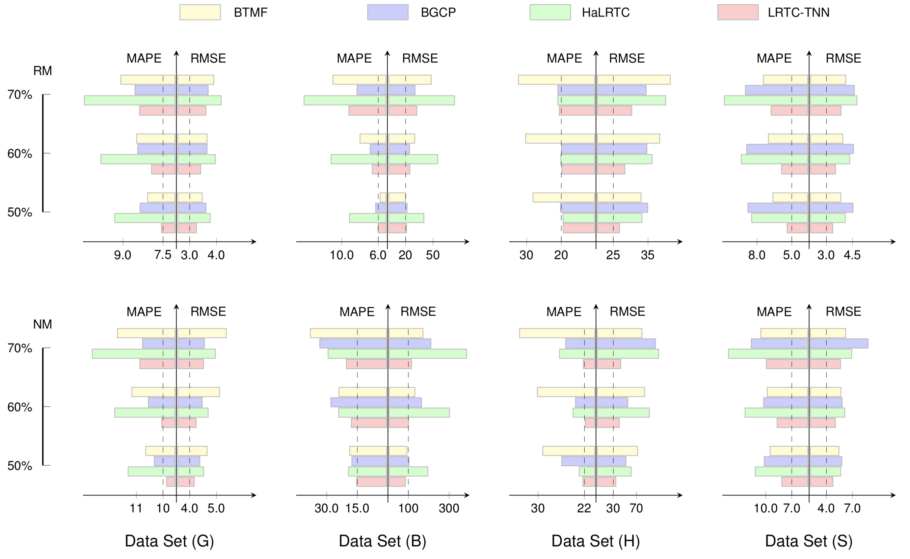

This example shows the imputation accuracy of some matrix and tensor models. To draw this example, we can follow these steps:

- **`preamble` codes**:
  1. define the `documentclass` as `standalone`,
  2. use the package `tikz`.
- **`body` codes**:
  1. use `\begin{tikzpicture} \end{tikzpicture}` to start drawing,
  2. use `\draw` command to define nodes,
  3. use `\pgfuseimage` command to import images.

 

### Vector Norms in Machine Learning

#### Manhattan Distance & L1 Norm

##### [Example 28]

<a href="https://github.com/xinychen/awesome-latex-drawing/blob/master/norms/manhattan_distance.tex">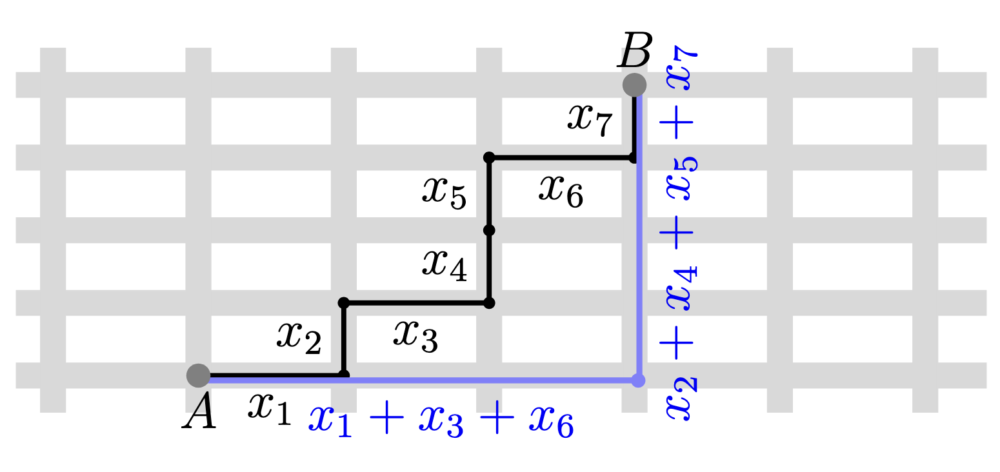

 

#### L2 Norm

##### [Example 29]

<a href="https://github.com/xinychen/awesome-latex-drawing/blob/master/norms/ell2_xy.tex">
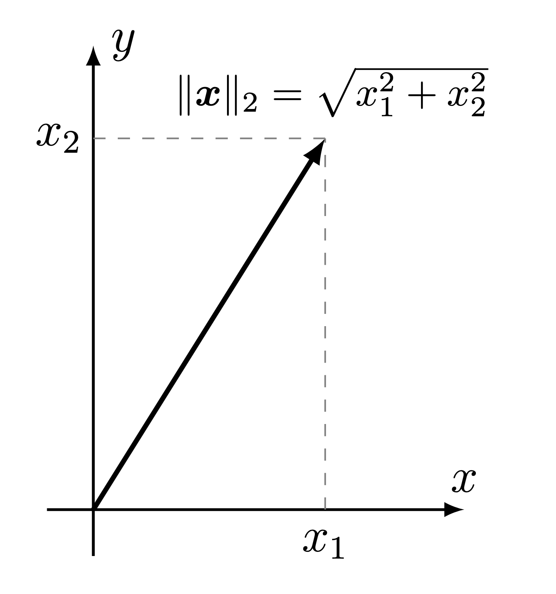
</a>
<a href="https://github.com/xinychen/awesome-latex-drawing/blob/master/norms/ell2_xyz.tex">
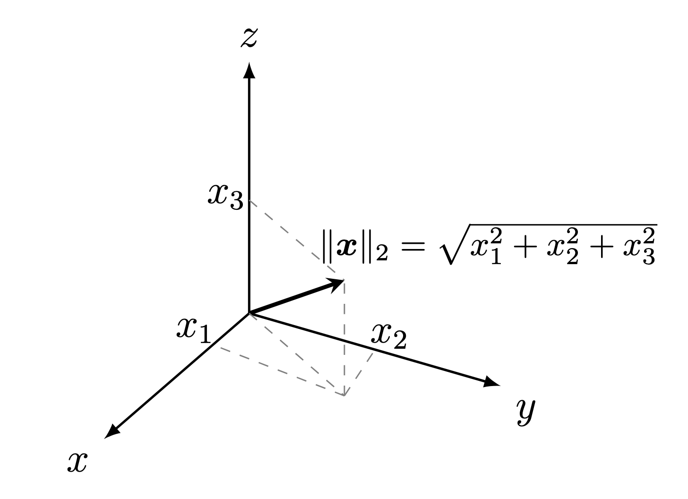
</a>

 

#### Unit Vectors

##### [Example 30]

<a href="https://github.com/xinychen/awesome-latex-drawing/blob/master/norms/ell1_norm.tex">
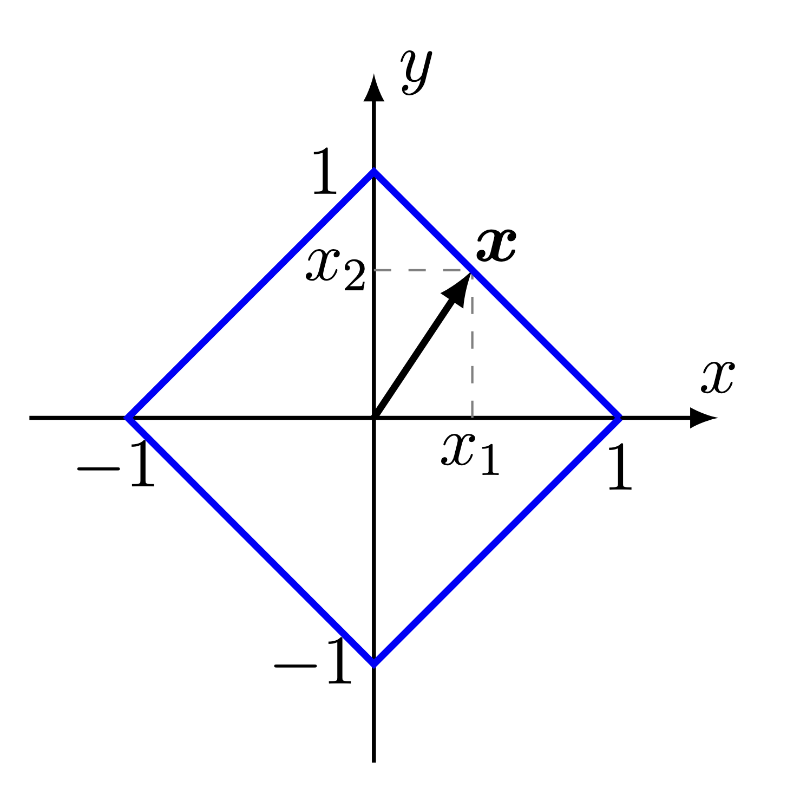
</a>
<a href="https://github.com/xinychen/awesome-latex-drawing/blob/master/norms/ell2_norm.tex">
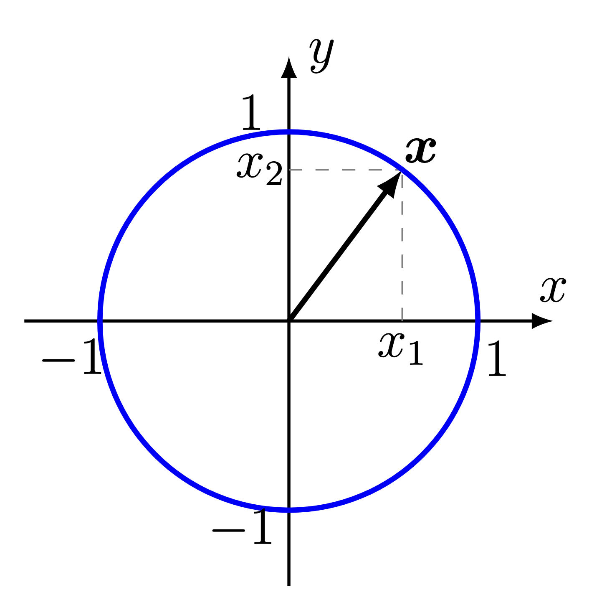
</a>
</a>
<a href="https://github.com/xinychen/awesome-latex-drawing/blob/master/norms/ell_infty_norm.tex">
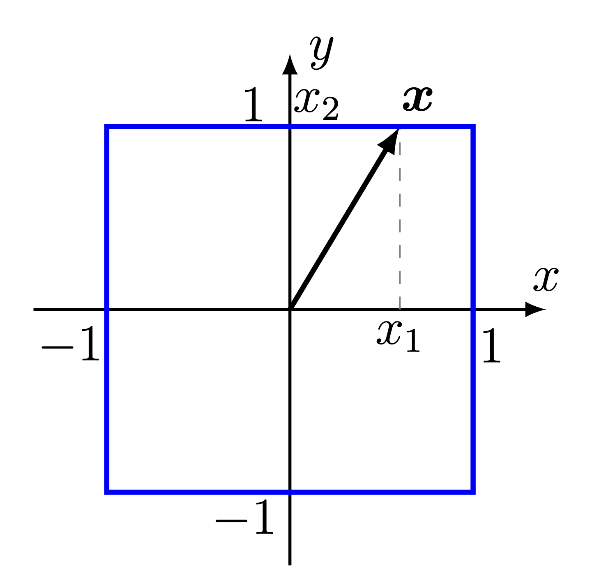
</a>

 

##### [Example 31]

<a href="https://github.com/xinychen/awesome-latex-drawing/blob/master/norms/unit_vector_black.tex">
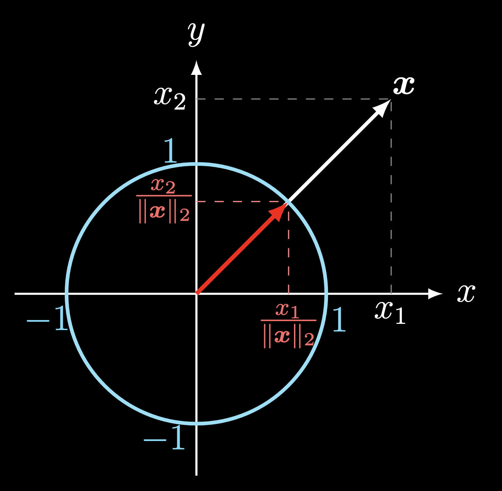
</a>
<a href="https://github.com/xinychen/awesome-latex-drawing/blob/master/norms/unit_vector_white.tex">
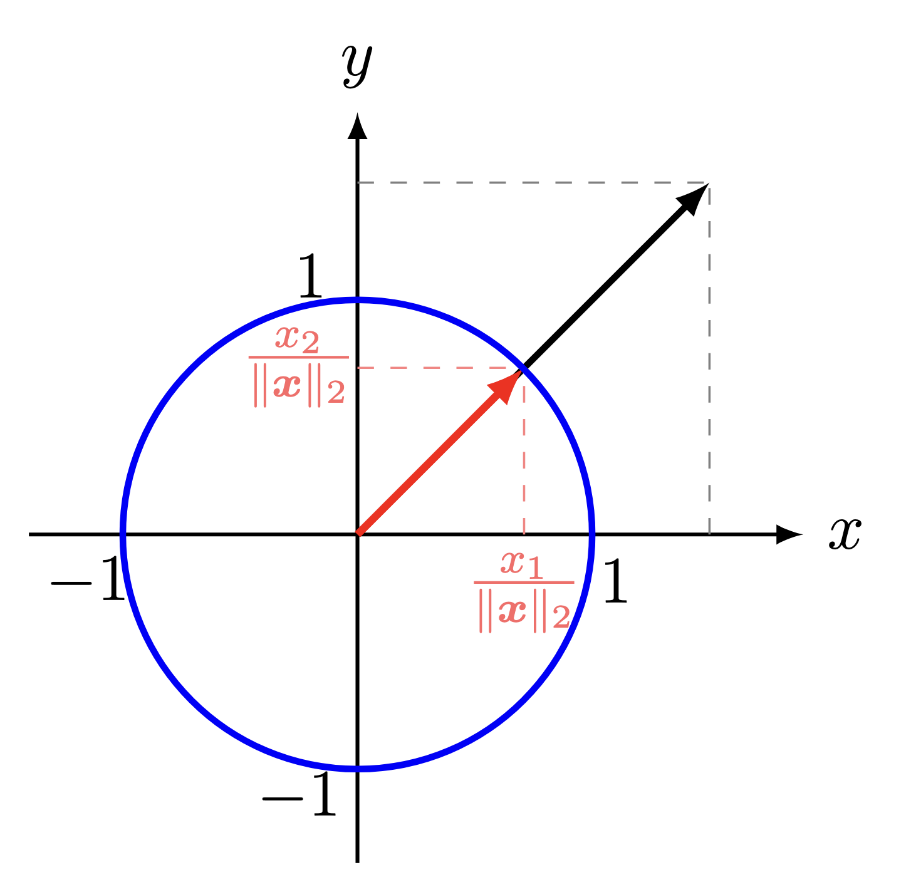
</a>

 

Publications
--------------
 
 Most of these examples are from our papers:
 
- Xinyu Chen, Zhanhong Cheng, HanQin Cai, Nicolas Saunier, Lijun Sun (2024). **Laplacian convolutional representation for traffic time series imputation**. IEEE Transactions on Knowledge and Data Engineering. 36 (11): 6490-6502. [[PDF](https://xinychen.github.io/papers/Laplacian_convolution.pdf)] [[DOI](https://doi.org/10.1109/TKDE.2024.3419698)] [[Slides](https://xinychen.github.io/slides/LCR24.pdf)] [[Blog post](https://spatiotemporal-data.github.io/posts/ts_conv/)] [[Data & Python code](https://github.com/xinychen/LCR)]

- Xinyu Chen, Lijun Sun (2022). **Bayesian temporal factorization for multidimensional time series prediction**. IEEE Transactions on Pattern Analysis and Machine Intelligence, 44 (9): 4659-4673. [[Preprint](https://arxiv.org/abs/1910.06366v2)] [[DOI](https://doi.org/10.1109/TPAMI.2021.3066551)] [[Slides](https://doi.org/10.5281/zenodo.4693404)] [[Data & Python code](https://github.com/xinychen/transdim)]

- Xinyu Chen, Mengying Lei, Nicolas Saunier, Lijun Sun (2022). **Low-rank autoregressive tensor completion for spatiotemporal traffic data imputation**. IEEE Transactions on Intelligent Transportation Systems, 23 (8): 12301-12310. [[Preprint](https://arxiv.org/abs/2104.14936)] [[DOI](https://doi.org/10.1109/TITS.2021.3113608)] [[Data & Python code](https://github.com/xinychen/transdim)] (Also accepted in part to [MiLeTS Workshop of KDD 2021](https://kdd-milets.github.io/milets2021/), see [workshop paper](https://kdd-milets.github.io/milets2021/papers/MiLeTS2021_paper_23.pdf))

- Xinyu Chen, Yixian Chen, Nicolas Saunier, Lijun Sun (2021). **Scalable low-rank tensor learning for spatiotemporal traffic data imputation**. Transportation Research Part C: Emerging Technologies, 129: 103226. [[Preprint](https://arxiv.org/abs/2008.03194)] [[DOI](https://doi.org/10.1016/j.trc.2021.103226)] [[Data](https://doi.org/10.5281/zenodo.3939792)] [[Python code](https://github.com/xinychen/transdim/tree/master/large-imputer)]

- Xinyu Chen, Lijun Sun (2020). **Low-rank autoregressive tensor completion for multivariate time series forecasting**. arXiv preprint arXiv: 2006.10436. [[Preprint](https://arxiv.org/abs/2006.10436)] [[Data & Python code](https://github.com/xinychen/tensor-learning)]

- Xinyu Chen, Jinming Yang, Lijun Sun (2020). **A nonconvex low-rank tensor completion model for spatiotemporal traffic data imputation**. Transportation Research Part C: Emerging Technologies, 117: 102673. [[Preprint](https://arxiv.org/abs/2003.10271v2)] [[DOI](https://doi.org/10.1016/j.trc.2020.102673)] [[Data & Python code](https://github.com/xinychen/transdim)]

- Xinyu Chen, Zhaocheng He, Yixian Chen, Yuhuan Lu, Jiawei Wang (2019). **Missing traffic data imputation and pattern discovery with a Bayesian augmented tensor factorization model**. Transportation Research Part C: Emerging Technologies, 104: 66-77. [[DOI](https://doi.org/10.1016/j.trc.2019.03.003)] [[Slides](https://doi.org/10.5281/zenodo.2632552)] [[Data](http://doi.org/10.5281/zenodo.1205229)] [[Matlab code](https://github.com/sysuits/BATF)] [[Python code](https://github.com/xinychen/transdim/blob/master/imputer/BATF.ipynb)]

- Xinyu Chen, Zhaocheng He, Lijun Sun (2019). **A Bayesian tensor decomposition approach for spatiotemporal traffic data imputation**. Transportation Research Part C: Emerging Technologies, 98: 73-84. [[Preprint](https://www.researchgate.net/publication/329177786_A_Bayesian_tensor_decomposition_approach_for_spatiotemporal_traffic_data_imputation)] [[DOI](https://doi.org/10.1016/j.trc.2018.11.003)] [[Data](http://doi.org/10.5281/zenodo.1205229)] [[Matlab code](https://github.com/lijunsun/bgcp_imputation)] [[Python code](https://github.com/xinychen/transdim/blob/master/experiments/Imputation-BGCP.ipynb)]

