Awesome LaTeX drawing
============

<h6 align="center">Made by Xinyu Chen • :globe_with_meridians: <a href="https://xinychen.github.io">https://xinychen.github.io</a></h6>

**awesome-latex-drawing** is a collection of **20+** academic drawing examples for using LaTeX, including Bayesian networks, function plotting, graphical models, tensor structure, and technical frameworks. [[**Blog post** on Medium](https://medium.com/p/e07916b2c860)]

## Description

LaTeX is a high-quality typesetting system, and it is available as a free software. In recent years, it is very popular for creating and drawing academic graphics via LaTeX. This is because that LaTeX is able to draw many complicated graphics containing special symbols and math equations. It is really good for using LaTeX to draw certain graphics in your research.This project introduces some graphics that created by using LaTeX. It would be easy to follow the examples with a popular online LaTeX system - Overleaf. If you are interested, welcome to use Overleaf and reproduce our examples. The Overleaf is available at [overleaf.com](https://www.overleaf.com/), please feel free to try it.

## Contents

**Table of Examples**

- **Bayesian networks**
  - [x] [Bayesian network of Bayesian CP factorization (BCPF)](https://github.com/xinychen/awesome-latex-drawing#example-1)
  - [x] [Bayesian network of Bayesian Gaussian CP (BGCP) factorization](https://github.com/xinychen/awesome-latex-drawing#example-2)
  - [x] [Bayesian network of Bayesian augmented tensor factorization (BATF)](https://github.com/xinychen/awesome-latex-drawing#example-3)
  - [x] [Bayesian network of Bayesian temporal matrix factorization (BTMF)](https://github.com/xinychen/awesome-latex-drawing#example-4)
- **`pgfplots` function plotting**
  - [x] [PDF and CDF functions of Erlang distribution](https://github.com/xinychen/awesome-latex-drawing#example-5)
  - [x] [PDF of normal distribution with different means and variances](https://github.com/xinychen/awesome-latex-drawing#example-6)
  - [x] [(Joint) PDF functions of Lognormal distributions](https://github.com/xinychen/awesome-latex-drawing#example-7)
  - [x] [Sine and Cosine functions](https://github.com/xinychen/awesome-latex-drawing#example-8)
  - [x] [Mechanism of time series forecasting](https://github.com/xinychen/awesome-latex-drawing#example-9)
- **`tikz-3dplot`** for tensor structure
  - [x] [Graphical illustration for the (origin,destination,time slot) tensor](https://github.com/xinychen/awesome-latex-drawing#example-10)
  - [x] [Graphical illustration of the classical CP tensor factorization on a third-order tensor](https://github.com/xinychen/awesome-latex-drawing#example-11)
  - [x] [Augmented tensor factorization (AuTF) model](https://github.com/xinychen/awesome-latex-drawing#example-12)
  - [x] [Graphical illustration of tensor completion task and its framework including data organization and tensor completion](https://github.com/xinychen/awesome-latex-drawing#example-13)

 

Usage
--------------

Open [**overleaf.com**](https://www.overleaf.com/) in your Chrome.

> It is not necessary to open each file in this repository because you can just follow this readme document.

 

## Gallery

Looking for some good LaTeX drawing examples? Here is a few (20+) to peruse.

 

### Bayesian Networks

LaTeX provides some powerful domain-specific packages and tools like `tikz` to enable flexible graphical models. Bayesian networks represent a family of graphical models consisting of variables (usually denoted by nodes) and dependency relationships (usually denoted by arrows). Fortunately, `tikz` has a specific library for drawing Bayesian networks and directed factor graphs.

#### Bayesian Tensor Factorization

##### [Example 1]

This example is from the following paper:

> - Qibin Zhao, Liqing Zhang, Andrzej Cichocki (2015). [Bayesian CP factorization of incomplete tensors with automatic rank determination](https://doi.org/10.1109/TPAMI.2015.2392756). IEEE Transactions on Pattern Analysis and Machine Intelligence, 37(9): 1751-1763.

which shows the Bayesian network of Bayesian CP factorization (BCPF) model. To draw this Bayesian network example, there are some preliminaries to follow:

 

- **`preamble` codes**:
  1. define the `documentclass` as `standalone`, e.g., `\documentclass[border = 0.1cm]{standalone}` with 0.1cm border,
  2. use package `tikz` in preamble, i.e., `\usepackage{tikz}`, and use `tikz` library like `\usetikzlibrary{bayesnet}` which is an important tool for drawing Bayesian networks and directed factor graphs,
  3. set the `tikz` style by using the `\tikzstyle{}` command,
  4. use math equation environments including `\usepackage{amsfonts, amsmath, amssymb}`.
- **`body` codes**:
  1. use `\begin{tikzpicture} \end{tikzpicture}` to start drawing,
  2. use `\node` to define nodes and text boxes in the Bayesian network,
  3. use `\path` to define arrows in the Bayesian network,
  4. use `\plate` to define plates in the Bayesian network.

> Please click on the image and check out the source code.

 

- Open [BGCP.tex](https://github.com/xinychen/awesome-latex-drawing/blob/master/BayesNet/BGCP.tex) in your overleaf project, then you will see the following pictures about BGCP (Bayesian Gaussian CP decomposition) model as a Bayesian network and a directed factor graph:

 

##### [Example 2] 

This example is from the following paper:

> Xinyu Chen, Zhaocheng He, Lijun Sun (2019). [A Bayesian tensor decomposition approach for spatiotemporal traffic data imputation](https://doi.org/10.1016/j.trc.2018.11.003). Transportation Research Part C: Emerging Technologies, 98: 73-84.

which shows the Bayesian network of Bayesian Gaussian CP factorization (BGCP) model. To draw this Bayesian network example, there are some preliminaries to follow:

 

- **`preamble` codes**:
  1. define the `documentclass` as `standalone`, e.g., `\documentclass[border = 0.1cm]{standalone}` with 0.1cm border,
  2. use package `tikz` in preamble, i.e., `\usepackage{tikz}`, and use `tikz` library like `\usetikzlibrary{bayesnet}` which is an important tool for drawing Bayesian networks and directed factor graph,
  3. set the `tikz` style by using the `\tikzstyle{}` command,
  4. use math equation environments including `\usepackage{amsmath, amsfonts, amssymb}`.
- **`body` codes**:
  1. use `\begin{tikzpicture} \end{tikzpicture}` to start drawing,
  2. use `\node` to define nodes and text boxes in the Bayesian network,
  3. use `\path` to define arrows in the Bayesian network,
  4. use `\plate` to define plates in the Bayesian network.

> Please click on the image and check out the source code. If you are interested in the original [Bayesian network of BGCP](BayesNet/BGCP.png) in the paper, please check out [BGCP.tex](https://github.com/xinychen/awesome-latex-drawing/blob/master/BayesNet/BGCP.tex).

 

##### [Example 3]

This example is from the following paper:

> Xinyu Chen, Zhaocheng He, Yixian Chen, Yuhuan Lu, Jiawei Wang (2019). [Missing traffic data imputation and pattern discovery with a Bayesian augmented tensor factorization model](https://doi.org/10.1016/j.trc.2019.03.003). Transportation Research Part C: Emerging Technologies, 104: 66-77.

which shows the Bayesian network of Bayesian augmented tensor factorization (BATF) model. To draw this Bayesian network example, there are some preliminaries to follow:

 

- **`preamble` codes**:
  1. define the `documentclass` as `standalone`, e.g., `\documentclass[border = 0.1cm]{standalone}` with 0.1cm border,
  2. use package `tikz` in preamble, i.e., `\usepackage{tikz}`, and use `tikz` library like `\usetikzlibrary{bayesnet}` which is an important tool for drawing Bayesian networks and directed factor graph,
  3. set the `tikz` style by using the `\tikzstyle{}` command,
  4. use math equation environments including `\usepackage{amsmath, amsfonts, amssymb}`.
- **`body` codes**:
  1. use `\begin{tikzpicture} \end{tikzpicture}` to start drawing,
  2. use `\node` to define nodes and text boxes in the Bayesian network,
  3. use `\path` to define arrows in the Bayesian network,
  4. use `\plate` to define plates in the Bayesian network.

> Please click on the image and check out the source code.

 

<!-- > - Open [btmf.tex](https://github.com/xinychen/awesome-latex-drawing/blob/master/BayesNet/btmf_net.tex) in your overleaf project, then you will see the following picture:
  >
  > 

  > 
  > 

  >
  > 

  > <b>Figure 5</b>: BTMF (Bayesian temporal matrix factorization) model as a Bayesian network and a directed factor graph.
  > 
 -->

This example is from the following paper:

> Xinyu Chen, Lijun Sun (2021). [Bayesian temporal factorization for multidimensional time series prediction](https://doi.org/10.1109/TPAMI.2021.3066551). IEEE Transactions on Pattern Analysis and Machine Intelligence. (Early access)

which shows the Bayesian network of Bayesian temporal matrix factorization (BTMF) model. To draw this Bayesian network example, there are some preliminaries to follow:

 

- **`preamble` codes**:
  1. define the `documentclass` as `standalone`, e.g., `\documentclass[border = 0.1cm]{standalone}` with 0.1cm border,
  2. use package `tikz` in preamble, i.e., `\usepackage{tikz}`, and use `tikz` library like `\usetikzlibrary{bayesnet}` which is an important tool for drawing Bayesian networks and directed factor graph,
  3. set the `tikz` style by using the `\tikzstyle{}` command,
  4. use math equation environments including `\usepackage{amsmath, amsfonts, amssymb}`.
- **`body` codes**:
  1. use `\begin{tikzpicture} \end{tikzpicture}` to start drawing,
  2. use `\node` to define nodes and text boxes in the Bayesian network,
  3. use `\path` to define arrows in the Bayesian network,
  4. use `\plate` to define plates in the Bayesian network.

> Please click on the image and check out the source code. Instead of multivariate vector autoregressive process on temporal factors, we can also use univariate autoregressive process to rebuild BTMF. The Beyasian network is available at [btmf_net.png](BayesNet/btmf_net.png), you can also check out the source code [btmf_net.tex](https://github.com/xinychen/awesome-latex-drawing/blob/master/BayesNet/btmf_net.tex).

 

### `pgfplots` function plotting

##### [Example 5]

These two examples show the probability density function (PDF) and cumulative density function (CDF) of Erlang distribution, respectively. To draw the example, there are few steps to follow:

 

- **`preamble` codes**:
  1. define the `documentclass` as `standalone`,
  2. use package `pgfplots` in preamble,
  3. set font style and adjust `\pgfplotsset{}` as you prefer.
- **`body` codes**:
  1. use `\begin{tikzpicture} \end{tikzpicture}` to start drawing,
  2. use `\begin{axis} \end{axis}` to draw the function,
  3. use `\addplot` to define the function for drawing.

 

##### [Example 6]

This example shows the PDF of normal distribution with different means and variances. To draw this example, there are few step to follow:

 

- **`preamble` codes**:
  1. define the `documentclass` as `standalone`,
  2. use package `pgfplots` in preamble,
  3. set font style and adjust `\pgfplotsset{}` as you prefer.
- **`body` codes**:
  1. use `\pgfmathdeclarefunction` to define the PDF function of normal (Gaussian) distribution,
  2. use `\begin{tikzpicture} \end{tikzpicture}` to start drawing,
  3. use `\begin{axis} \end{axis}` to draw the function,
  4. use `\addplot` to define the function for drawing.
- **More posts**:
  1. [Plotting Normal distribution in pgfplots](https://tex.stackexchange.com/questions/100022)
  2. [number format in pgfplots axis](https://tex.stackexchange.com/questions/31276)
  3. [Remove the scientific notation which is unreasonable](https://tex.stackexchange.com/questions/119887)

 

##### [Example 7]

These two examples show the PDF and joint PDF of Lognormal distributions, respectively. There are some recommended material to follow the examples:

 

- **More posts**:
  1. [Draw a bivariate normal distribution in TikZ](https://tex.stackexchange.com/questions/31708)
  2. [How can two bivariate normal distributions be plotted in one plot?](https://tex.stackexchange.com/questions/198741)
  3. [Plotting a Bivariate Normal Distribution in Tikz](https://tex.stackexchange.com/questions/236721)
  4. [Split curve with addplot3](https://tex.stackexchange.com/questions/629567)

 

##### [Example 8]

This example shows four sequences consisting of Sine and Cosine functions. When regarding these sequences as time series, then we can see two kinds of temporal dynamics, that is, one is from Sine function, while another is from Cosine function. To draw this example, we can follow these steps:

 

- **`preamble` codes**:
  1. define the `documentclass` as `standalone`,
  2. use package `pgfplots` in preamble,
  3. set font style and adjust `\pgfplotsset{}` as you prefer.
- **`body` codes**:
  1. use `\pgfmathdeclarefunction` to define the PDF function of normal (Gaussian) distribution,
  2. use `\begin{tikzpicture} \end{tikzpicture}` to start drawing,
  3. use `\begin{axis} \end{axis}` to draw the function,
  4. use `\addplot` to define the function for drawing.

 

##### [Example 9]

This example illustrates the mechanism of time series forecasting on streaming data in our [tracebase](https://github.com/xinychen/tracebase) project. To draw this example, we can follow these steps:

 

- **`preamble` codes**:
  1. define the `documentclass` as `standalone`,
  2. use both `tikz` and `pgfplots` packages in preamble,
  3. set font style and adjust `\pgfplotsset{}` as you prefer.
- **`body` codes**:
  1. use `\begin{tikzpicture} \end{tikzpicture}` to start drawing,
  2. use `\begin{axis} \end{axis}` to define the graphic,
  3. use `addplot` to define the marks at some coordinates and specify the color of these marks.

 

### `tikz-3dplot` for tensor structure

##### [Example 10]

This example gives a graphical illustration of a third-order tensor. To draw this example, we can follow these steps:

 

- **`preamble` codes**:
  1. define the `documentclass` as `standalone`,
  2. use both `tikz` and `tikz-3dplot` packages in preamble.
- **`body` codes**:
  1. set `\Depth`, `\Width`, and `\Height` parameters by using `\newcommand`,
  2. use `\begin{tikzpicture} \end{tikzpicture}` to start drawing,
  3. define the coordinates of the tensor edges,
  4. use `\draw` cammand to define nodes.

 

##### [Example 11]

This example gives a graphical illustration of classical CP tensor factorization on a third-order tensor. To draw this example, we can follow these steps:

 

- **`preamble` codes**:
  1. define the `documentclass` as `standalone`,
  2. use both `tikz` and `tikz-3dplot` packages.
- **`body` codes**:
  1. set `\Depth`, `\Width`, and `\Height` parameters by using `\newcommand`,
  2. use `\begin{tikzpicture} \end{tikzpicture}` to start drawing,
  3. define the coordinates of the tensor edges,
  4. use `\draw` cammand to define nodes.

 

##### [Example 12]

This example gives a graphical illustration of augmented tensor factorization model. To draw this example, we can follow these steps:

 

- **`preamble` codes**:
  1. define the `documentclass` as `standalone`,
  2. use both `tikz` and `tikz-3dplot` packages.
- **`body` codes**:
  1. set `\Depth`, `\Width`, and `\Height` parameters by using `\newcommand`,
  2. use `\begin{tikzpicture} \end{tikzpicture}` to start drawing,
  3. define the coordinates of the tensor edges,
  4. use `\draw` cammand to define nodes.

 

##### [Example 13]

This example gives a graphical illustration of tensor completion task and its framework including data organization and tensor completion, in which traffic measurements are partially observed. To draw this example, we can follow these steps:

<a href="https://github.com/xinychen/awesome-latex-drawing/blob/master/Framework/tc_framework.tex">

 

- **Request**:
  1. upload [curve1.pdf](https://github.com/xinychen/awesome-latex-drawing/blob/master/Framework/curve1.pdf),
  2. upload [curve2.pdf](https://github.com/xinychen/awesome-latex-drawing/blob/master/Framework/curve2.pdf).
- **`preamble` codes**:
  1. define the `documentclass` as `standalone`,
  2. use both `tikz` and `tikz-3dplot` packages.
- **`body` codes**:
  1. set `\Depth`, `\Width`, and `\Height` parameters by using `\newcommand`,
  2. use `\begin{tikzpicture} \end{tikzpicture}` to start drawing,
  3. define the coordinates of the tensor edges,
  4. use `\draw` cammand to define nodes.

 

  > - Open [rolling_prediction_strategy.tex](https://github.com/xinychen/awesome-latex-drawing/blob/master/Framework/rolling_prediction_strategy.tex) in your overleaf project, then you will see the following picture:
  >
  > 

  > 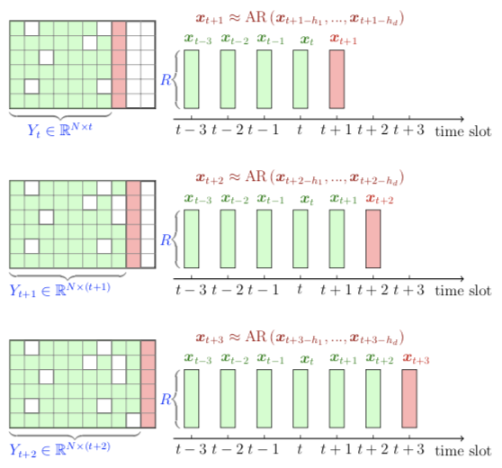
  > 

  >
  > 

  > <b>Figure 8</b>: A graphical illustration of rolling prediction strategy with temporal matrix factorization and autoregressive model.
  > 

  >
  > - Open [rolling_prediction.tex](https://github.com/xinychen/awesome-latex-drawing/blob/master/Framework/rolling_prediction.tex) in your overleaf project, then you will see the following picture:
  >
  > 

  > 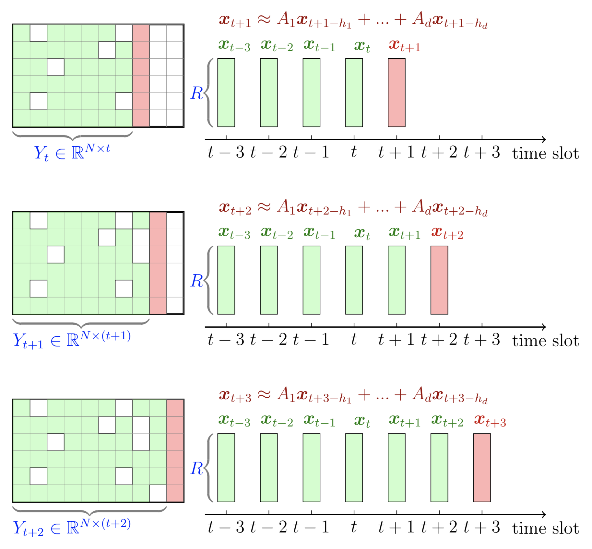
  > 

  >
  > 

  > <b>Figure 9</b>: A graphical illustration of rolling prediction strategy with temporal matrix factorization and vector autoregressive model.
  > 

  >
  > - Open [graphical_time_series.tex](https://github.com/xinychen/awesome-latex-drawing/blob/master/Framework/graphical_time_series.tex) in your overleaf project, then you will see the following picture:
  >
  > 

  > 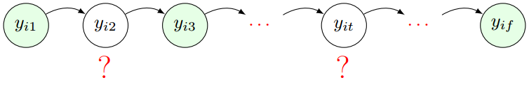
  > 

  >
  > 

  > <b>Figure 10</b>: A graphical illustration of the partially observed time series data.
  > 

  >
  > - Open [tensor_time_series.tex](https://github.com/xinychen/awesome-latex-drawing/blob/master/Framework/tensor_time_series.tex) in your overleaf project, then, you will see the following picture:
  >
  > 

  > 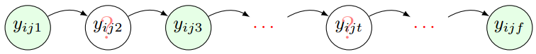
  > 

  >
  > 

  > <b>Figure 11</b>: A graphical illustration of the partially observed time series tensor.
  > 

  >
  > - Open [graphical_matrix_time_series.tex](https://github.com/xinychen/awesome-latex-drawing/blob/master/Framework/graphical_matrix_time_series.tex) in your overleaf project, then you will see the following picture:
  >
  > 

  > 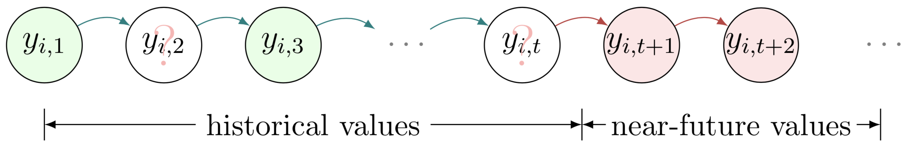
  > 

  >
  > 

  > <b>Figure 12</b>: Multivariate time series data prediction with missing values.
  > 

  >
  > - Open [graphical_tensor_time_series.tex](https://github.com/xinychen/awesome-latex-drawing/blob/master/Framework/graphical_tensor_time_series.tex) in your overleaf project, then you will see the following picture:
  >
  > 

  > 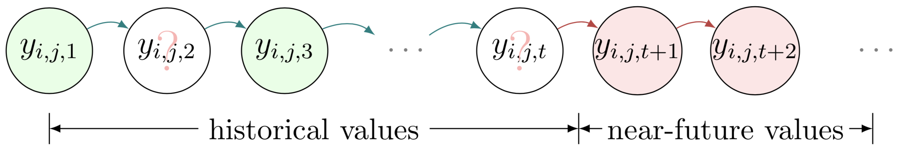
  > 

  >
  > 

  > <b>Figure 13</b>: Tensor time series data prediction with missing values.
  > 

  >
  > - Open [mf-explained.tex](https://github.com/xinychen/awesome-latex-drawing/blob/master/Framework/mf-explained.tex) in your overleaf project, then you will see the following picture:
  >
  > 

  > 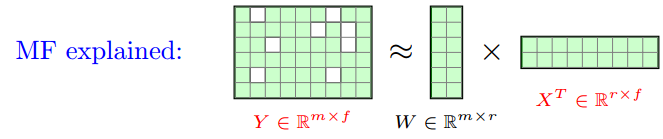
  > 

  >
  > 

  > <b>Figure 14</b>: A graphical illustration of matrix factorization.
  > 

  >
  > - Open [LRTC-flow.tex](https://github.com/xinychen/awesome-latex-drawing/blob/master/Framework/LRTC-flow.tex) and upload
  >   - [input_tensor.pdf](https://github.com/xinychen/awesome-latex-drawing/blob/master/Framework/input_tensor.pdf)
  >   - [output_tensor.pdf](https://github.com/xinychen/awesome-latex-drawing/blob/master/Framework/output_tensor.tex)
  >
  > in your overleaf project, then you will see the following picture:
  >
  > 

  > 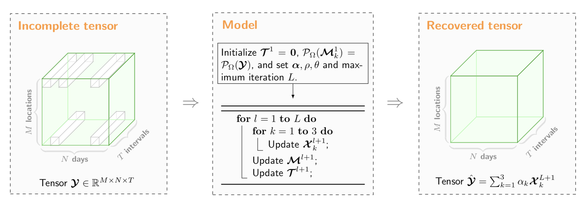
  > 

  >
  > 

  > <b>Figure 15</b>: A graphical illustration of low-rank tensor completion model.
  > 

  >
  > - Open [latc_framework](https://github.com/xinychen/awesome-latex-drawing/blob/master/Framework/latc_framework.tex) in your overleaf project, then you will see the following picture:
  >
  > 

  > 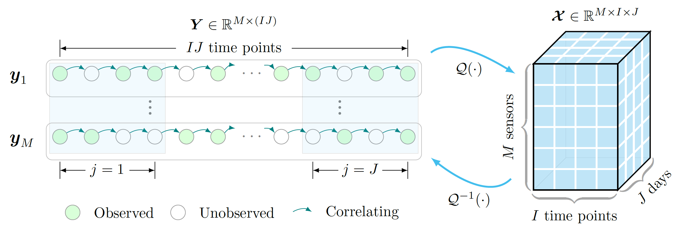
  > 

  >
  > 

  > <b>Figure 16</b>: A graphical illustration of low-rank autoregressive tensor completion model.
  > 

  >
  >
  > - Open [TVART.tex](https://github.com/xinychen/awesome-latex-drawing/blob/master/TensorFactorization/TVART.tex) in your overleaf project, then you will see the following picture:
  >
  > 

  > 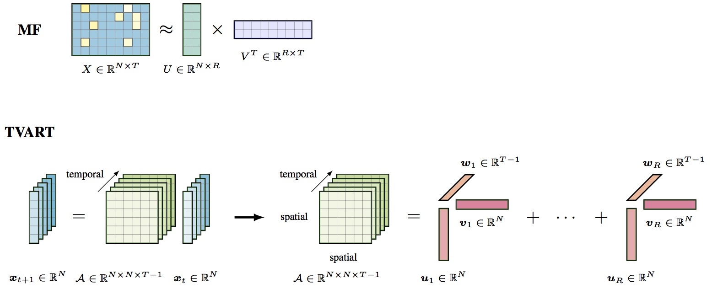
  > 

  >
  > 

  > <b>Figure 19</b>: Tensor regression model.
  > 

  >
  > - Open [tensor_svt.tex](https://github.com/xinychen/awesome-latex-drawing/blob/master/TensorFactorization/tensor_svt.tex) in your overleaf project, then you will see the following picture:
  >
  > 

  > 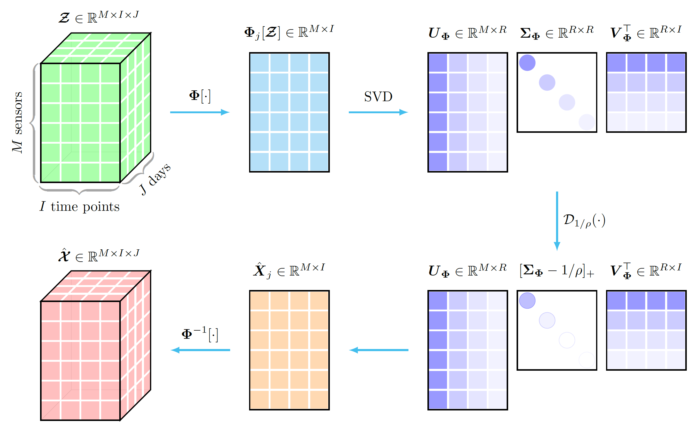
  > 

  >
  > 

  > <b>Figure 20</b>: Singular value thresholding process of the tensor data with unitary transform.
  > 

  >
  > ### Data Visualization
  >
  > - Open [RMseries.tex](https://github.com/xinychen/awesome-latex-drawing/blob/master/data-visualization/RMseries.tex) in your overleaf project, then you will see the following picture:
  >
  > 

  > 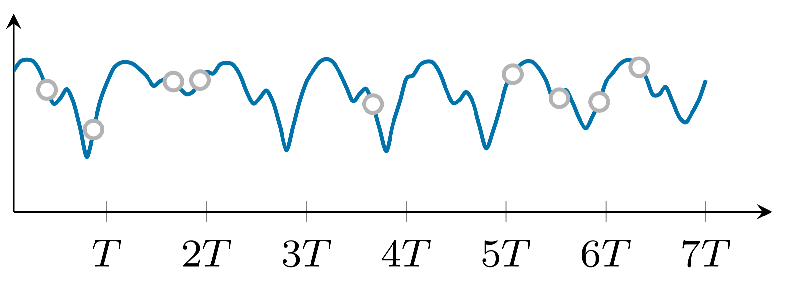
  > 

  >
  > 

  > <b>Figure 22</b>: Random missing pattern.
  > 

  >
  > - Open [NMseries.tex](https://github.com/xinychen/awesome-latex-drawing/blob/master/data-visualization/NMseries.tex) in your overleaf project, then you will see the following picture:
  >
  > 

  > 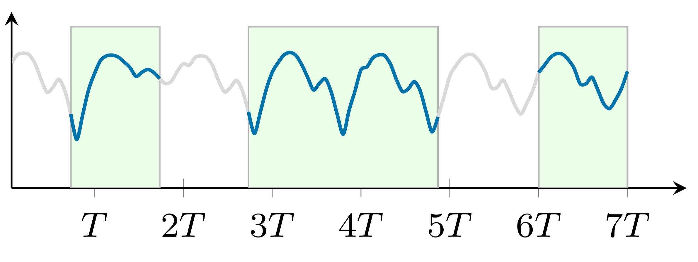
  > 

  >
  > 

  > <b>Figure 23</b>: Non-random missing pattern.
  > 

  >
  > - Open [performance_bar.tex](https://github.com/xinychen/awesome-latex-drawing/blob/master/data-visualization/performance_bar.tex) and upload
  >   - [RM_Gdata.pdf](https://github.com/xinychen/awesome-latex-drawing/blob/master/data-visualization/RM_Gdata.pdf)
  >   - [RM_Bdata.pdf](https://github.com/xinychen/awesome-latex-drawing/blob/master/data-visualization/RM_Bdata.pdf)
  >   - [RM_Hdata.pdf](https://github.com/xinychen/awesome-latex-drawing/blob/master/data-visualization/RM_Hdata.pdf)
  >   - [RM_Sdata.pdf](https://github.com/xinychen/awesome-latex-drawing/blob/master/data-visualization/RM_Sdata.pdf)
  >   - [NM_Gdata.pdf](https://github.com/xinychen/awesome-latex-drawing/blob/master/data-visualization/NM_Gdata.pdf)
  >   - [NM_Bdata.pdf](https://github.com/xinychen/awesome-latex-drawing/blob/master/data-visualization/NM_Bdata.pdf)
  >   - [NM_Hdata.pdf](https://github.com/xinychen/awesome-latex-drawing/blob/master/data-visualization/NM_Hdata.pdf)
  >   - [NM_Sdata.pdf](https://github.com/xinychen/awesome-latex-drawing/blob/master/data-visualization/NM_Sdata.pdf)
  >
  > in your overleaf project, then you will see the following picture:
  >
  > 

  > 
  > 

  >
  > 

  > <b>Figure 24</b>: Imputation performance.
  > 

  >
  > If you want to draw each sub-figure, please check out the following `.tex` files:
  >
  >   - Sub-figure at the 1st row and 1st column: [RM_Gdata.tex](https://github.com/xinychen/awesome-latex-drawing/blob/master/data-visualization/RM_Gdata.tex)
  >   - Sub-figure at the 1st row and 2nd column: [RM_Bdata.tex](https://github.com/xinychen/awesome-latex-drawing/blob/master/data-visualization/RM_Bdata.tex)
  >   - Sub-figure at the 1st row and 3rd column: [RM_Hdata.tex](https://github.com/xinychen/awesome-latex-drawing/blob/master/data-visualization/RM_Hdata.tex)
  >   - Sub-figure at the 1st row and 4th column: [RM_Sdata.tex](https://github.com/xinychen/awesome-latex-drawing/blob/master/data-visualization/RM_Sdata.tex)
  >   - Sub-figure at the 2nd row and 1st column: [NM_Gdata.tex](https://github.com/xinychen/awesome-latex-drawing/blob/master/data-visualization/NM_Gdata.tex)
  >   - Sub-figure at the 2nd row and 2nd column: [NM_Bdata.tex](https://github.com/xinychen/awesome-latex-drawing/blob/master/data-visualization/NM_Bdata.tex)
  >   - Sub-figure at the 2nd row and 3rd column: [NM_Hdata.tex](https://github.com/xinychen/awesome-latex-drawing/blob/master/data-visualization/NM_Hdata.tex)
  >   - Sub-figure at the 2nd row and 4th column: [NM_Sdata.tex](https://github.com/xinychen/awesome-latex-drawing/blob/master/data-visualization/NM_Sdata.tex)
  >
  >
  > ### Awesome Stuff
  >
  > - Open
  >   - [transdim_logo_large.tex](https://github.com/xinychen/awesome-latex-drawing/blob/master/awesome-stuff/transdim_logo_large.tex)
  > - Upload
  >   - [jay.pdf](https://github.com/xinychen/awesome-latex-drawing/blob/master/awesome-stuff/jay.pdf)
  >
  > in your overleaf project, then, you will see the following picture:
  >
  > 

  > 
  > 

  >
  > 

  > <b>Figure 25</b>: transdim logo.
  > 

Recommended Posts
-----------

1. [draw colored world/US map in LaTeX](https://tex.stackexchange.com/questions/183087)
2. [geographic maps with TikZ/pgfplots](https://tex.stackexchange.com/questions/36059)

More Features
--------------
> Coming soon...

Related Projects
--------------

- [tikz-bayesnet](https://github.com/jluttine/tikz-bayesnet)
- [awesome-tikz](https://github.com/xiaohanyu/awesome-tikz)
- [transdim](https://github.com/xinychen/transdim)

Publications
--------------
 
 Most of these examples are from our papers:
 
- Xinyu Chen, Mengying Lei, Nicolas Saunier, Lijun Sun (2021). **Low-rank autoregressive tensor completion for spatiotemporal traffic data imputation**. IEEE Transactions on Intelligent Transportation Systems. [[Preprint](https://arxiv.org/abs/2104.14936)] [[DOI](https://doi.org/10.1109/TITS.2021.3113608)] [[Data & Python code](https://github.com/xinychen/transdim)] (Also accepted in part to [MiLeTS Workshop of KDD 2021](https://kdd-milets.github.io/milets2021/), see [workshop paper](https://kdd-milets.github.io/milets2021/papers/MiLeTS2021_paper_23.pdf))

- Xinyu Chen, Yixian Chen, Nicolas Saunier, Lijun Sun (2021). **Scalable low-rank tensor learning for spatiotemporal traffic data imputation**. Transportation Research Part C: Emerging Technologies, 129: 103226. [[Preprint](https://arxiv.org/abs/2008.03194)] [[DOI](https://doi.org/10.1016/j.trc.2021.103226)] [[Data](https://doi.org/10.5281/zenodo.3939792)] [[Python code](https://github.com/xinychen/transdim/tree/master/large-imputer)]

- Xinyu Chen, Lijun Sun (2021). **Bayesian temporal factorization for multidimensional time series prediction**. IEEE Transactions on Pattern Analysis and Machine Intelligence. (Early access) [[Preprint](https://arxiv.org/abs/1910.06366v2)] [[DOI](https://doi.org/10.1109/TPAMI.2021.3066551)] [[Slides](https://doi.org/10.5281/zenodo.4693404)] [[Data & Python code](https://github.com/xinychen/transdim)]

- Xinyu Chen, Lijun Sun (2020). **Low-rank autoregressive tensor completion for multivariate time series forecasting**. arXiv: 2006.10436. [[Preprint](https://arxiv.org/abs/2006.10436)] [[Data & Python code](https://github.com/xinychen/tensor-learning)]

- Xinyu Chen, Jinming Yang, Lijun Sun (2020). **A nonconvex low-rank tensor completion model for spatiotemporal traffic data imputation**. Transportation Research Part C: Emerging Technologies, 117: 102673. [[Preprint](https://arxiv.org/abs/2003.10271v2)] [[DOI](https://doi.org/10.1016/j.trc.2020.102673)] [[Data & Python code](https://github.com/xinychen/transdim)]

- Xinyu Chen, Zhaocheng He, Yixian Chen, Yuhuan Lu, Jiawei Wang (2019). **Missing traffic data imputation and pattern discovery with a Bayesian augmented tensor factorization model**. Transportation Research Part C: Emerging Technologies, 104: 66-77. [[DOI](https://doi.org/10.1016/j.trc.2019.03.003)] [[Slides](https://doi.org/10.5281/zenodo.2632552)] [[Data](http://doi.org/10.5281/zenodo.1205229)] [[Matlab code](https://github.com/sysuits/BATF)] [[Python code](https://github.com/xinychen/transdim/blob/master/imputer/BATF.ipynb)]

- Xinyu Chen, Zhaocheng He, Lijun Sun (2019). **A Bayesian tensor decomposition approach for spatiotemporal traffic data imputation**. Transportation Research Part C: Emerging Technologies, 98: 73-84. [[Preprint](https://www.researchgate.net/publication/329177786_A_Bayesian_tensor_decomposition_approach_for_spatiotemporal_traffic_data_imputation)] [[DOI](https://doi.org/10.1016/j.trc.2018.11.003)] [[Data](http://doi.org/10.5281/zenodo.1205229)] [[Matlab code](https://github.com/lijunsun/bgcp_imputation)] [[Python code](https://github.com/xinychen/transdim/blob/master/experiments/Imputation-BGCP.ipynb)]

> Please cite our papers if you find these codes help your research.
